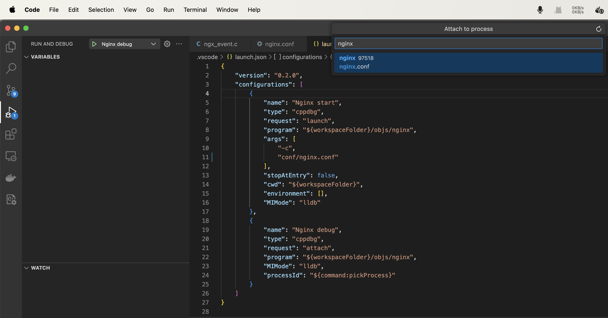
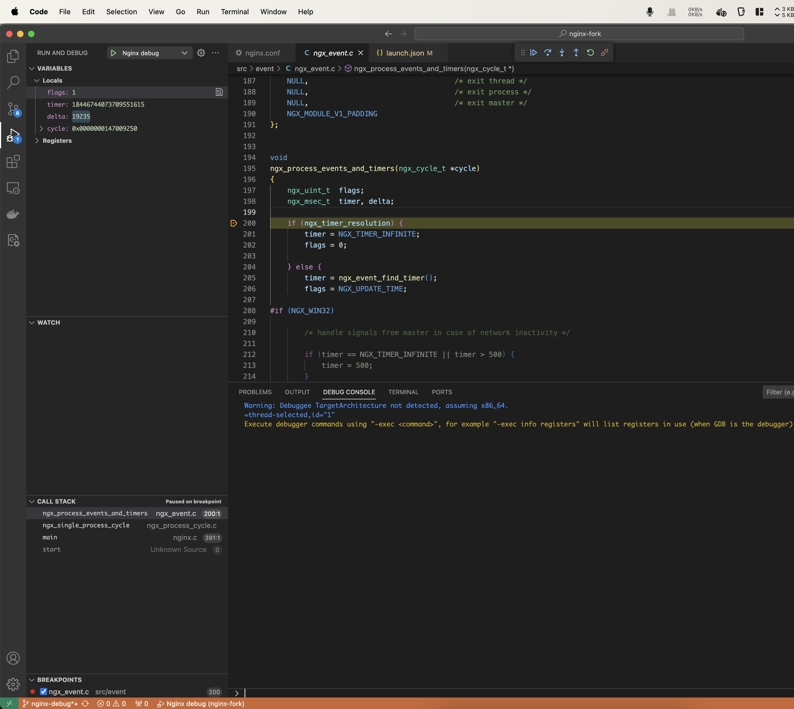

# How to stepping debug NGINX on Visual Studio Code(MacOSX Apple Silicon)

Stepping debugging is an awesome way to understand how NGINX works compared to source code reading, and debugging with a GUI makes life easier :)

This tutorial demonstrates how to stepping debug NGINX on Visual Studio Code(MacOSX Apple Silicon). Since the gdb is not supported on Apple Silicon, this tutorial is based on [LLDB debugger](https://lldb.llvm.org/).

### Compile NGINX with debugging symbols enabled

What is debug symbols?

Debug symbols helps obtain additional information for debugging, such as functions, variables, data structures, source file and line number information.


```shell
$ ./auto/configure --prefix=nginx --with-cc-opt='-O0 -g'
```

- -g: include debugging symbols
- -O0: disabling compiler optimization to make the debugger output easier to understand 
- --prefix: install in nginx directory of current directory


### Install NGINX

```shell
$ make

$ make install

$ objs/nginx -V

nginx version: nginx/1.25.4
built by clang 15.0.0 (clang-1500.0.40.1)
configure arguments: --prefix=nginx --with-cc-opt='-O0 -g'
```

### Setup NGINX configuration

Add the following configuration to  `nginx/conf/nginx.conf` for better debugging.

```nginx configuration
daemon off;
master_process off;
```

### Start NGINX

Start NGINX by running command:
```
$ ./objs/nginx -p nginx -c conf/nginx.conf
```

Send a curl in another terminal to ensure NGINX start successfully.
```
$ curl http://localhost

<!DOCTYPE html>
<html>
<head>
<title>Welcome to nginx!</title>
<style>
html { color-scheme: light dark; }
body { width: 35em; margin: 0 auto;
font-family: Tahoma, Verdana, Arial, sans-serif; }
</style>
</head>
<body>
<h1>Welcome to nginx!</h1>
<p>If you see this page, the nginx web server is successfully installed and
working. Further configuration is required.</p>

<p>For online documentation and support please refer to
<a href="http://nginx.org/">nginx.org</a>.<br/>
Commercial support is available at
<a href="http://nginx.com/">nginx.com</a>.</p>

<p><em>Thank you for using nginx.</em></p>
</body>
</html>

```

### Debug NGINX

Click "Nginx debug" and select nginx process to attach.



### Set breakpoints

Set a breakpoint in function `ngx_process_events_and_timers` in `src/event/ngx_event.c`, and NGINX will be paused immediately. Sending requests to NGINX at this point will get no response as the event loop is blocking unless we resume the program. 

We can observe the variables on the top-left VARIABLES section, call stack on the bottom-left CALL STACK section.





References:
- https://docs.nginx.com/nginx/admin-guide/monitoring/debugging/
